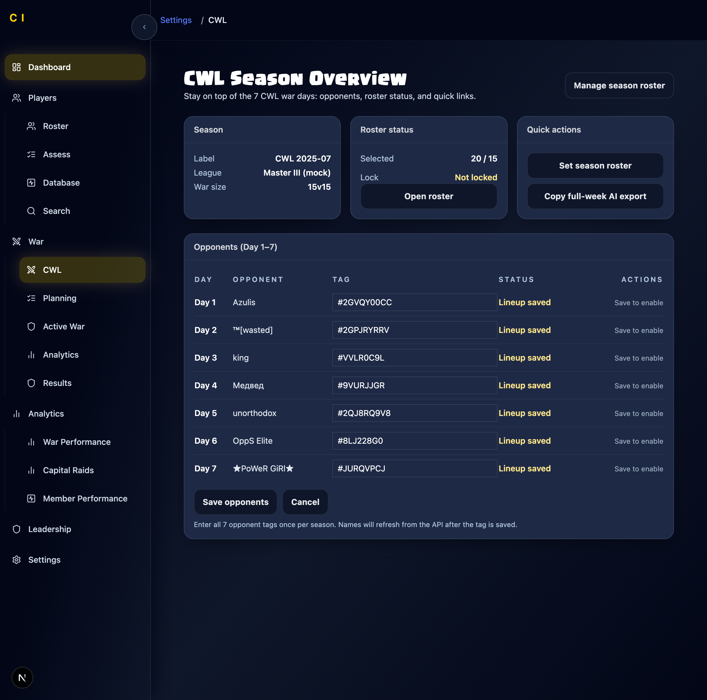
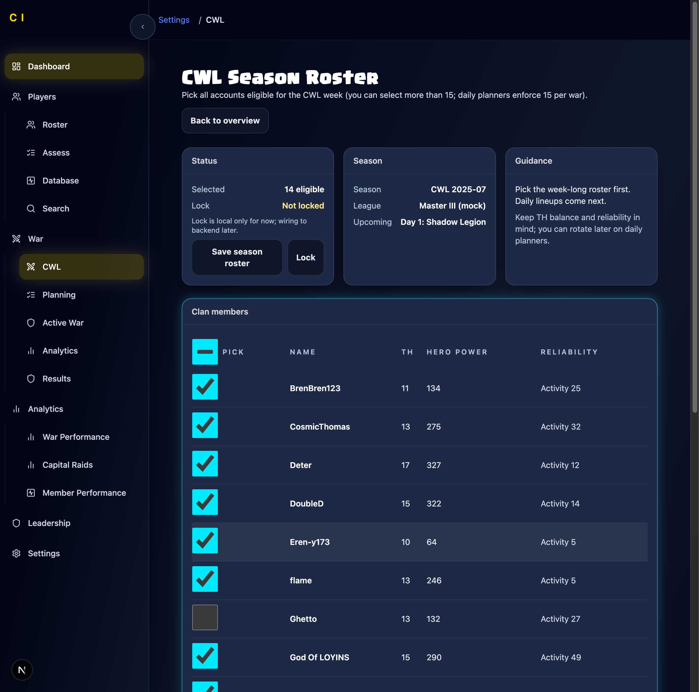
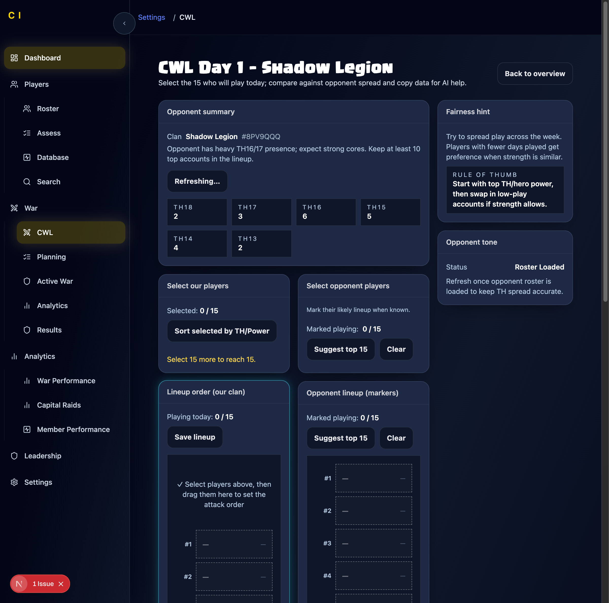

# CWL Current Workflow Documentation

**Last Updated:** December 24, 2025  
**Purpose:** Accurate documentation of the current CWL planning workflow, including screenshots and identified pain points, to establish a foundation for planning improvements.

---

## Table of Contents

1. [Overview](#overview)
2. [Workflow Steps](#workflow-steps)
3. [Technical Implementation Details](#technical-implementation-details)
4. [Pain Points & UX Issues](#pain-points--ux-issues)
5. [Screenshots](#screenshots)

---

## Overview

The current CWL planning system consists of three main pages:

1. **Season Overview** (`/new/war/cwl`) - View opponents and roster status
2. **Season Roster** (`/new/war/cwl/roster`) - Select eligible players for the week
3. **Day Planner** (`/new/war/cwl/day/[day]`) - Plan daily lineups

**Key Limitation:** The system is a **planning layer only** - it does not sync with in-game CWL rosters. All data must be manually entered and maintained.

---

## Workflow Steps

### Step 1: Season Overview (`/new/war/cwl`)

**Purpose:** View the 7-day CWL season, see opponent clans, and access daily planners.

**What You See:**
- Season metadata (hardcoded: "CWL 2025-07", "Master III (mock)", "15v15")
- Roster status card showing "X / 15" selected players
- Opponents table with 7 rows (Day 1-7)
- Quick action buttons

**Screenshot:** `cwl-01-season-overview.png`

**Current Flow:**

1. **Page Loads:**
   - Uses `sampleSeasonSummary` from `cwl-data.ts` (hardcoded client-side)
   - Tries to read opponents from `localStorage` (key: `cwl_opponents_cache_${seasonId}_${warSize}`)
   - Fetches opponents from Supabase via `GET /api/cwl/opponents`
   - Fetches saved lineups via `GET /api/cwl/lineup` to mark days with saved lineups
   - Fetches eligible roster via `GET /api/cwl/eligible` to show "Selected / warSize"

2. **Edit Opponents:**
   - Click "Edit opponents" button
   - If no rows loaded, first calls `/api/cwl/opponents` to hydrate rows
   - Each day row becomes editable with tag input (must be valid `#TAG` format)
   - On "Save opponents":
     - Normalizes all tags
     - Calls `/api/war/opponent?opponentTag=TAG` per row to fetch clan names
     - POSTs to `/api/cwl/opponents` with `thDistribution: null, rosterSnapshot: null, fetchedAt: null` (only tag + name stored)
     - Re-fetches opponents and caches in localStorage

**Screenshot:** `cwl-02-edit-opponents.png`

3. **Open Day Planner:**
   - "Open planner" button appears only when tag is present (or saved)
   - Routes to `/new/war/cwl/day/[day]`

4. **Copy Full-Week AI Export:**
   - Button fetches each opponent via `opponent?opponentTag=...&enrich=50` (only if all 7 tags are valid)
   - Pulls our roster via `useRosterData()` (from `/api/v2/roster`) and filters by `eligibleSet`
   - Copies JSON payload (roster + opponents) to clipboard
   - **Client-side only** - no server storage

**Key Issues:**
- Season summary is mocked; league, warSize, season label are not pulled from DB
- Opponent "status" in table is UI-derived: if a lineup exists for that day, status shows "Lineup saved" even if opponent roster isn't loaded
- No validation that all 7 opponents are set before allowing day planners to open

---

### Step 2: Season Roster (`/new/war/cwl/roster`)

**Purpose:** Select which players are eligible for the entire CWL week (the pool from which daily lineups are chosen).

**What You See:**
- Status card showing selected count and lock status
- Season info card (hardcoded)
- Guidance card with instructions
- Large table of all clan members with checkboxes

**Screenshot:** `cwl-03-season-roster.png`

**Current Flow:**

1. **Page Loads:**
   - Uses `useRosterData()` to pull current roster
   - If roster exists:
     - Builds `computedRoster` entries with `name`, `tag`, `TH`, `heroPower`, `reliability`
     - `heroPower = bk+aq+gw+rc+mp`
     - `reliability` = Activity `{activityScore}` if present
   - If roster is empty, falls back to `sampleRoster` (from `cwl-data.ts`)

2. **Initial Selection Behavior:**
   - On first load after eligible roster hydration:
     - If no saved eligible roster and selection is empty, **auto-selects the first `warSize` players from `sortedRoster`**
     - `sortedRoster` is sorted **alphabetically**, not by TH or power
     - This auto-selection happens silently without user notification

3. **Selecting Players:**
   - Checkboxes add/remove tags to `selected` Set
   - "Select all" checkbox selects/deselects all players
   - No enforcement of exactly `warSize` at selection time
   - Can select more or fewer than 15

4. **Save Season Roster:**
   - POSTs to `/api/cwl/eligible` with tags + basic metadata
   - API writes to Supabase `cwl_eligible_members` (replace strategy: delete then insert)
   - **Important:** The save payload includes `heroLevels`, but the roster rows created in this page don't include hero level objects, so `heroLevels` ends up `null` unless roster members have a `.heroes` property (which they don't in this UI)

5. **Lock Toggle:**
   - "Lock" toggles a **local boolean only**
   - **Does NOT persist to DB**
   - Note says "Lock is local only for now; wiring to backend later"

**Key Issues:**
- Auto-selection of first 15 players (alphabetically) is confusing - users may not realize this happened
- No enforcement of exactly `warSize` at save time - can save more or fewer
- Sorting is alphabetical, not by strength/TH - makes it hard to find top players
- Lock functionality is misleading (doesn't actually lock anything)
- Hero levels not properly saved (payload includes them but they're null)

---

### Step 3: Day Planner (`/new/war/cwl/day/[day]`)

**Purpose:** Plan the daily lineup for a specific CWL war day - select which 15 players will play and optionally mark opponent lineup.

**What You See:**
- Day header with opponent name
- Opponent summary card (TH distribution, strength note)
- "Select our players" section with checkbox list
- "Select opponent players" section
- "Lineup order" drag-and-drop area (15 slots)
- "Opponent lineup" drag-and-drop area (15 slots)
- AI export buttons

**Screenshot:** `cwl-04-day-planner.png`

**Current Flow:**

1. **Page Loads:**
   - Tries to restore cached lineup from `localStorage` (key: `cwl_lineup_cache_${seasonId}_${warSize}_${dayIndex}`)
   - Fetches opponents via `/api/cwl/opponents` (Supabase) and finds the row for the day
   - Fetches eligible roster via `/api/cwl/eligible` to build the eligible pool
   - Fetches lineup via `/api/cwl/lineup?dayIndex=...` and sets `lineupOrder` + `opponentOrder` from stored data

2. **Roster Source + Filtering:**
   - If roster is still loading, shows nothing (avoids sample fallback)
   - Once roster loads:
     - Builds `computedRoster` from current roster members
     - Then filters to `eligiblePool` if it exists
     - If no roster members exist, falls back to `sampleRoster`

3. **Opponent Roster:**
   - Automatically calls `opponent?opponentTag=...&enrich=50` on load (if tag is valid)
   - `thDistribution` is derived from enriched top-N members (default 12, capped at 50)
   - **Not the entire clan** unless fully enriched
   - Opponent summary includes static text `sampleOpponentStrengthNote` (does not compute strength)

4. **Suggested Players:**
   - `suggested = computedRoster.slice(0, warSize)` (**alphabetical list**)
   - There is a "Suggested" badge in the selection list, but it's **not based on TH/heroPower**
   - Just shows first 15 alphabetically

5. **Selecting "Our Lineup":**
   - Checkbox list adds/removes tags to `lineupOrder` (same array drives selection + order)
   - Status shows "too few / too many / ready" but **no server validation**
   - Can select more or fewer than 15

6. **Opponent Selection:**
   - Opponent player checkboxes toggle `opponentOrder`
   - "Suggest top {warSize}" uses `readinessScore` (only present for enriched players)

7. **Lineup Ordering:**
   - Drag-and-drop (hello-pangea/dnd) reorders `lineupOrder` and `opponentOrder`
   - The "Lineup order" pane shows `warSize` slots; missing items show placeholders
   - Must manually drag players to set order

8. **Save:**
   - "Save lineup" POSTs to `/api/cwl/lineup` (Supabase `cwl_day_lineups`)
   - **No enforcement of exact size** - UI warnings only
   - Can save with 0, 10, 20, etc. players

9. **AI Export:**
   - "Copy for AI" copies: Our roster (eligible filtered) + opponent data + thDistribution
   - "Copy matchup prompt" includes the selected lineups (ours + opponent)

10. **Caching:**
    - Lineup + opponent order are cached in `localStorage` per day

**Key Issues:**
- Suggested players are alphabetical, not strength-based
- No enforcement of exactly 15 players - can save invalid lineups
- Opponent TH distribution only uses enriched members (top 12-50), not full clan
- Opponent strength is placeholder text, not computed
- Must manually drag-and-drop to set order (no "auto-order by TH" button)
- No visual indication of which players have already played in previous days
- Fairness hint is generic text, not personalized to actual player participation

---

## Technical Implementation Details

### Data Model

**Supabase Tables:**
- `cwl_seasons` (created on demand)
- `cwl_opponents` (stores opponent tags/names per day)
- `cwl_eligible_members` (stores season roster)
- `cwl_day_lineups` (stores daily lineups)
- `cwl_day_results` (exists but UI doesn't use it)

### API Routes

- `/api/cwl/eligible` - Manages eligible season roster (`route.ts`)
- `/api/cwl/opponents` - Manages opponent tags/names by day (`route.ts`)
- `/api/cwl/lineup` - Manages day lineups (`route.ts`)
- `/api/cwl/season` - **Exists but UI doesn't use it** (`route.ts`)
- `/api/cwl/result` - **Exists but UI doesn't use it** (`route.ts`)
- `/api/war/opponent` - Fetches live opponent clan data and partial enrichment (`route.ts`)

### Global Assumptions + Defaults

- Season metadata is **hardcoded client-side** from `sampleSeasonSummary` (seasonId `2025-07`, warSize `15`, league `"Master III (mock)"`) in `cwl-data.ts`
- Backend endpoints default to `seasonId=2025-07` and `warSize=15` if not supplied; they use `cfg.homeClanTag` for the clan
- There is **no in-game CWL roster sync** - the system is a planning layer only

### Data Flow Issues

1. **Season Data:** UI uses mock data instead of calling `/api/cwl/season`
2. **Opponent Status:** Derived from lineup existence, not actual opponent data loading
3. **Hero Levels:** Saved as null because roster members don't have `.heroes` property
4. **Suggested Players:** Alphabetical, not strength-based
5. **TH Distribution:** Only uses enriched members (top 12-50), not full clan roster

---

## Pain Points & UX Issues

### Critical Issues

1. **No Season Data Integration**
   - Season label, league, and war size are hardcoded
   - Cannot handle multiple seasons or different war sizes
   - `/api/cwl/season` exists but is never called

2. **Misleading Auto-Selection**
   - Season roster page auto-selects first 15 players alphabetically
   - No notification that this happened
   - Users may not realize their roster was pre-selected

3. **No Validation**
   - Can save season roster with any number of players (0, 5, 20, 30)
   - Can save daily lineup with any number of players
   - Only UI warnings, no enforcement

4. **Alphabetical Sorting**
   - Season roster sorted alphabetically, not by strength
   - Suggested players are alphabetical, not TH/hero-power based
   - Makes it hard to find top players

5. **Opponent Data Incomplete**
   - TH distribution only uses enriched members (top 12-50)
   - Opponent strength is placeholder text, not computed
   - No way to see full opponent roster

6. **Lock Doesn't Work**
   - "Lock" button is local-only, doesn't persist
   - Misleading to users who think it's actually locked

### UX Flow Issues

1. **No Clear Entry Point**
   - Unclear whether to set roster first or opponents first
   - No onboarding or guided flow

2. **Disconnected Pages**
   - Each page feels isolated
   - No clear indication of progress through the workflow
   - No "next step" guidance

3. **Manual Data Entry**
   - Must manually enter all 7 opponent tags
   - No bulk import or copy-paste
   - No validation that tags are correct

4. **Drag-and-Drop Required**
   - Must manually drag players to set lineup order
   - No "auto-order by TH" or "auto-order by hero power" option
   - Time-consuming for 15 players

5. **No Fairness Tracking**
   - Fairness hint is generic text
   - No visual indication of who has played how many days
   - No automatic suggestions based on participation

6. **Confusing Status Indicators**
   - "Lineup saved" appears even if opponent roster isn't loaded
   - Status doesn't clearly indicate what's actually ready

7. **No Results Integration**
   - `/api/cwl/result` exists but UI doesn't use it
   - Cannot track actual war results
   - Cannot compare planned vs actual lineups

### Technical Debt

1. **Mock Data Everywhere**
   - `sampleSeasonSummary`, `sampleOpponents`, `sampleRoster` used as fallbacks
   - Makes it unclear what's real vs mock data

2. **localStorage Caching**
   - Heavy reliance on localStorage for caching
   - Can get out of sync with server data
   - No cache invalidation strategy

3. **Missing Hero Data**
   - Hero levels not properly saved
   - Payload includes them but they're null

4. **Unused Endpoints**
   - `/api/cwl/season` and `/api/cwl/result` exist but aren't used
   - Suggests incomplete implementation

---

## Screenshots

### Screenshot 1: Season Overview

**What it shows:**
- Season metadata (hardcoded)
- Roster status (20/15 selected - over-selected)
- Opponents table with all 7 days
- Each day shows "Lineup saved" status

### Screenshot 2: Edit Opponents

**What it shows:**
- Editable tag inputs for each day
- "Save opponents" and "Cancel" buttons
- Instruction text about entering tags

### Screenshot 3: Season Roster

**What it shows:**
- Status card (14 eligible, not locked)
- Season info (hardcoded)
- Guidance card
- Large table of clan members with checkboxes
- Players sorted alphabetically
- "Save season roster" and "Lock" buttons

### Screenshot 4: Day Planner

**What it shows:**
- Day 1 header with opponent "Shadow Legion"
- Opponent summary with TH distribution
- "Select our players" section (0/15 selected)
- "Select opponent players" section
- Lineup order drag-and-drop area (15 empty slots)
- Opponent lineup drag-and-drop area (15 empty slots)
- AI export buttons
- Fairness hint and opponent tone cards

---

## Next Steps for Improvement

Based on this documentation, the following improvements should be prioritized:

1. **Wire Real Season Data**
   - Call `/api/cwl/season` to get actual season info
   - Remove hardcoded mock data
   - Support multiple seasons

2. **Fix Validation**
   - Enforce exactly `warSize` players in season roster
   - Enforce exactly `warSize` players in daily lineups
   - Show clear errors when validation fails

3. **Improve Sorting & Suggestions**
   - Sort by TH/hero power, not alphabetically
   - Suggest players based on strength, not alphabet
   - Show fairness indicators (days played)

4. **Complete Opponent Data**
   - Fetch full opponent roster, not just top 12-50
   - Compute actual strength metrics
   - Show full TH distribution

5. **Fix Lock Functionality**
   - Wire lock to backend
   - Actually prevent edits when locked
   - Show clear lock status

6. **Improve UX Flow**
   - Add onboarding/guided flow
   - Show progress indicators
   - Add "next step" guidance
   - Auto-order lineup options

7. **Wire Results**
   - Use `/api/cwl/result` to track actual war results
   - Compare planned vs actual lineups
   - Show participation tracking

---

**End of Document**

