# Clash Intelligence System Manual (Framework)

## 1. Purpose & Maintenance
- **Goal:** Capture every page, field, API, and workflow so leaders can operate or audit the platform without digging through code.
- **Audience:** Engineering, clan admins, and trusted contributors.
- **Update Rules:** Any PR touching UI, API, or infra must update the relevant subsection here (or link to a deeper doc).
- **Change Log:** Keep a short dated note per major revision at the bottom of this file.

## 2. Table of Contents
1. Hosting & Environment Matrix
2. Authentication & Access Control
3. Onboarding Experience
4. Dashboard Modules & UI Inventory
5. API Surface (REST + Internal Helpers)
6. Data Sources & Supabase Schema Links
7. Automation, Testing, & Monitoring
8. Operational Playbooks & Runbooks
9. Appendices (Glossary, Permissions, Open Questions, Change Log)

---

### 1. Hosting & Environment Matrix

| Host | Purpose | Notes |
| --- | --- | --- |
| `clashintelligence.com` / `www.clashintelligence.com` | Generic marketing splash, links to clan subdomains; no login | `middleware.ts` marks this config as `marketingOnly` to hide the login form and show contact email `info@clashintelligence.com`. |
| `heckyeah.clashintelligence.com` | Primary HeckYeah clan portal (production) | Shows clan-branded hero, onboarding, login, and dashboard. |
| `heckyeah.localhost`, `heckyeah.localhost.localdomain` | Local dev hostnames for clan portal | Map to `127.0.0.1` (and IPv6) in `/etc/hosts`; used in Playwright tests. |
| `localhost:5050` | Local Next.js dev server default | `npm run dev` binds here; Playwright webServer starts/stops this unless `PLAYWRIGHT_SKIP_WEBSERVER=true`. |
| `localhost:5110` | Alternate dev server for e2e (`npm run dev:e2e`) | Use env overrides (`PLAYWRIGHT_BASE_URL`, etc.) when port 5050 is busy. |

**Deployment Targets**
- **Production:** Vercel project `clash-intelligence` (main branch), uses runtime env vars defined in Vercel dashboard.
- **Preview:** Vercel preview deployments per PR; same Next.js app with `VERCEL_ENV=preview`.
- **Local:** `npm run dev` / `npm run dev:e2e`. Ingestion scripts run via `tsx scripts/…` on developer machines or scheduled Mac launch agents.

**Environment Variables (minimum)**
- `NEXT_PUBLIC_SUPABASE_URL`, `NEXT_PUBLIC_SUPABASE_ANON_KEY` – required by browser + server auth helpers.
- `SUPABASE_SERVICE_ROLE_KEY` – loaded via `getSupabaseAdminClient` for trusted routes.
- `OPENAI_API_KEY`, optional `WAR_PLANNING_AI_MODEL` – enable AI analysis; without them the UI labels the source as “Heuristic”.
- `HOME_CLAN_TAG` (surfaced through `cfg.homeClanTag`) – default clan tag for host configs.
- `NEXT_PUBLIC_APP_VERSION` – injected by scripts; purely informational.
- Secrets for ingestion monitors, Upstash, KV, etc. (document per script in Section 8).

**Static Assets & Fonts**
- Marketing hero styles live in `src/app/page.tsx` (generic) and `src/app/[clan]/landing` components.
- Clash Display font is bundled (see global CSS) and applied to clan headings (e.g., `Welcome to HeckYeah`).
- Screenshots/diagrams belong in `docs/assets/` (create as needed); reference them via relative paths.

### 2. Authentication & Access Control

**Supabase Auth Flow**
1. User visits `/login` on a clan host (marketing host redirects them to email contact instead). Component: `LoginFormClient`.
2. Form calls `supabase.auth.signInWithPassword`. Successful login pushes to `/app`.
3. `SupabaseSessionSync` listens for auth events and POSTs to `/api/auth/callback`, which sets server-side cookies so Route Handlers can read the session.
4. `useDashboardStore.hydrateSession()` calls `/api/session` to fetch `{ user, roles, needsOnboarding }`. `AuthGate` uses this state to guard pages or redirect to `/onboarding`.

**Login Pages**
- **Generic Login:** 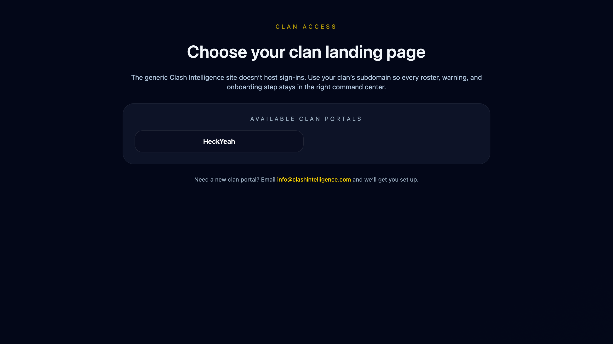
  - **How to reproduce:** Visit `http://localhost:5050/login` (apex host), shows "Choose your clan landing page" messaging.
- **Clan Login:** 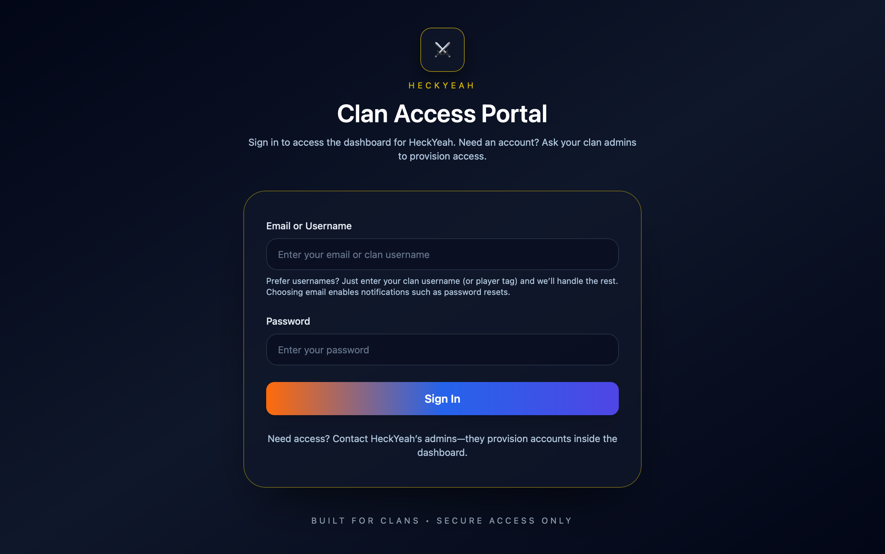
  - **How to reproduce:** Visit `http://heckyeah.localhost:5050/login` (clan host), shows clan access portal form with email/password fields.

**Roles & Permissions**
- Backed by `user_roles` table: `{ user_id, clan_id, clan_tag, role, player_tag }`.
- `getUserClanRoles()` normalizes tags; roles feed into `ACCESS_LEVEL_PERMISSIONS` for UI gating (Quick Actions, ingestion monitor).
- `LeadershipGuard` and hooks in `src/hooks/useLeadership.ts` enforce leadership-only features (war planning, access controls).
- `AuthGate` also prevents non-leaders from visiting `/war` because every war-planning API calls `requireLeadership`.

**Session API (`/api/session`)**
- Returns `{ success, data: { user, roles, needsOnboarding } }`.
- `needsOnboarding` is `true` if any role lacks `player_tag`.
- Error cases: unauthenticated returns `{ user: null, roles: [] }`; network failures set `sessionStatus` to `error`, prompting “Sign In Required”.

### 3. Onboarding Experience

**Entry Conditions**
- `AuthGate` checks `needsOnboarding` after session load and `router.replace('/onboarding')` if true.
- Users who already selected a tag see the “You’re already onboarded” screen; repeated hits to `/onboarding` post-success show a success card while redirecting back to `/app`.

**UI Flow (`src/app/onboarding/OnboardingClient.tsx`)**
1. **Roster Fetch:** Calls `/api/onboarding/roster` (credentials included). Loading + error states surfaced in the first `GlassCard`.
2. **Selection Grid:** Buttons per roster member showing name, tag, TH level, role, war pref. Clicking toggles selection (gold border indicates chosen).
3. **Selection Summary:** Lists primary identity (first selection) plus minis. Each row shows metadata and a "Remove" button; `Clear all` resets.
4. **Submit:** "Complete onboarding" button posts to `/api/onboarding/submit-tags`. Success stores `{ primaryTag, linkedCount }`, flips `setNeedsOnboarding(false)`, and displays the success card ("You're all set") with auto-redirect + quick links.
5. **Already Onboarded:** If `needsOnboarding` false on entry, renders quick actions ("Go to dashboard", "Manage access").

**Screenshots**
- **Onboarding Guard (Unauthenticated):** 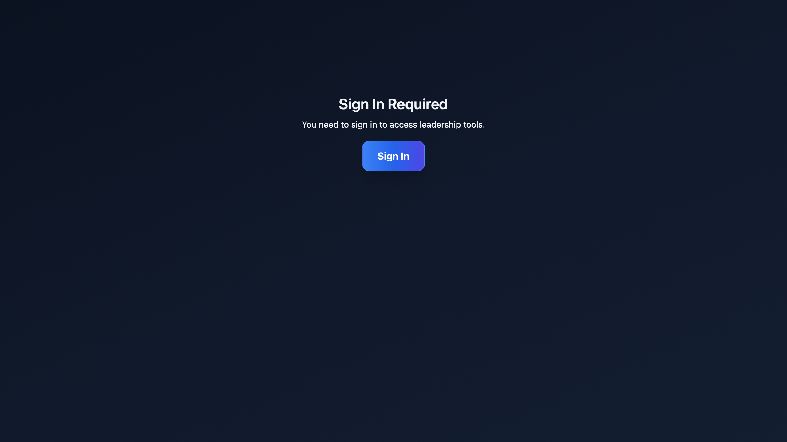
  - **How to reproduce:** Sign out, visit `/onboarding`, shows "Sign In Required" screen.
- **Already Onboarded:** 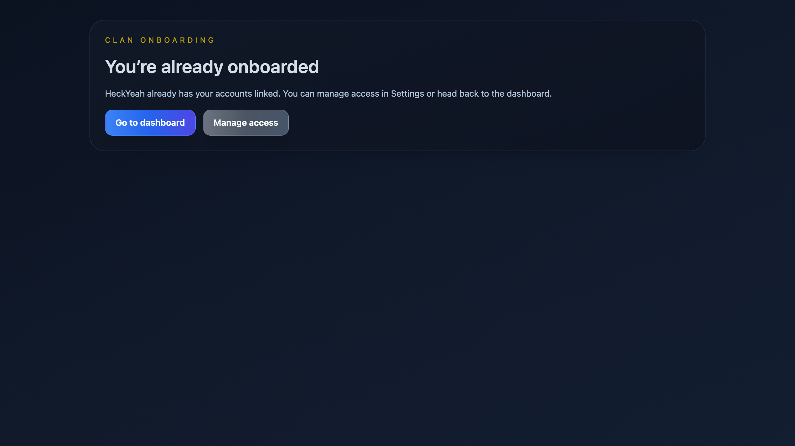
  - **How to reproduce:** Sign in as user with `needsOnboarding=false`, navigate to `/onboarding`, shows "You're already onboarded" view.
- **Onboarding Form:** (Requires `player_tag = null` in Supabase for test user)
  - **How to reproduce:** Temporarily clear test user's `player_tag` in `user_roles` table, sign in, navigate to `/onboarding`, shows roster grid with selection cards.
- **Onboarding Success:** (Requires completing onboarding flow)
  - **How to reproduce:** After selecting tags and clicking "Complete onboarding", shows success card with "You're all set" message.

**APIs**
- `/api/onboarding/roster` – infers clan from headers (`x-clan-tag`); returns latest roster snapshot from Supabase. Response `{ success, data: { roster } }`.
- `/api/onboarding/submit-tags` – Body `{ selectedTags: string[] }`. Validates tags, ensures they exist in `canonical_member_snapshots`, updates `user_roles.player_tag`, and links additional tags via `linkPlayerTags`. Returns `{ primaryTag, linkedCount }`.
- Both routes require auth; missing session results in 401 JSON errors consumed by the UI.

**Edge Cases**
- Empty roster → UI shows “No roster data found” and disables completion.
- Invalid tag selection → server responds 400 with explicit error (displayed in red alert).
- Linking failures → logged server-side; primary tag still persists, but alias count may be less than selected.

**Testing References**
- `tests/e2e/onboarding.spec.ts` – unauthenticated guard shows “Sign In Required”.
- `tests/e2e/onboarding-auth.spec.ts` – ensures completion flows to `/app`.
- `tests/e2e/full-ux.spec.ts` – exercises onboarding as part of broader journey and verifies already-onboarded pathways.

### 3. Onboarding Experience
- **Entry Conditions:** Redirect logic from `AuthGate`, when `needsOnboarding` flips.
- **UI Steps:** Roster fetch, selection card, summary panel, success state, already-onboarded screen.
- **APIs:** `/api/onboarding/roster`, `/api/onboarding/submit-tags` (include headers, payloads, validation rules, alias linking).
- **Edge Cases:** Missing roster, invalid tags, alias auto-link failures, repeated visits.
- **Testing:** Reference Playwright specs (`onboarding.spec.ts`, `onboarding-auth.spec.ts`, `full-ux.spec.ts`).

### 4. Dashboard Modules & UI Inventory
Each subsection below lists route, purpose, field inventory, backend sources, and screenshot TODOs. Capture reference screenshots via Playwright MCP (headed mode) and store under `docs/assets/dashboard/<slug>.png`.

#### 4.1 Main Dashboard (`/app`)
- **Purpose:** Primary roster intelligence view. Renders within `DashboardLayout`, composed from `simple-roster` modules.
- **Key Components:**
  - **Quick Actions (`src/components/layout/QuickActions.tsx`):** Buttons for ingestion, roster refresh, permissions, etc. Visibility governed by `LeadershipGuard`.
  - **Roster Grid/List (`src/app/simple-roster`):** Shows each member’s TH, role, trophies, tenure, ACE metrics. Data originates from `/api/v2/war-planning/our-roster` (Supabase snapshots).
  - **Status banners:** Snapshot age, ingestion status, and smart insights (if available).
- **Interactions:**
  - Refresh data, open ingestion monitor, change roster view (cards/table), impersonate leadership role (if allowed).
  - Clicking a member opens player profile modal.
- **Error/Empty:** "Checking access…" (AuthGate), notifications when roster fetch fails, skeleton loaders while data hydrates.
- **Screenshot:** 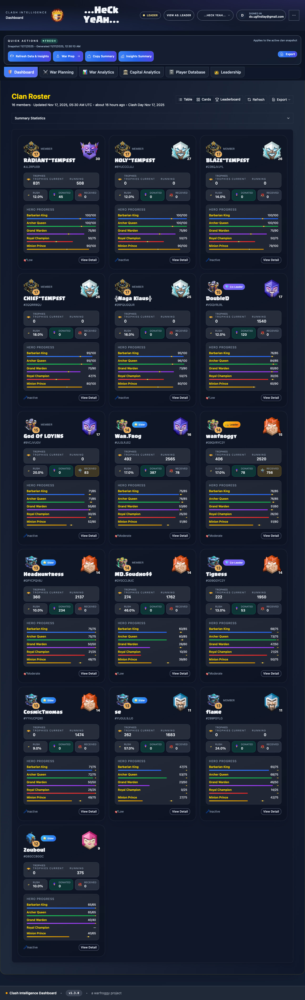
  - **How to reproduce:** Sign in as leader, navigate to `/app`, wait for roster to load and Quick Actions to be visible.
- **Quick Actions Detail:** 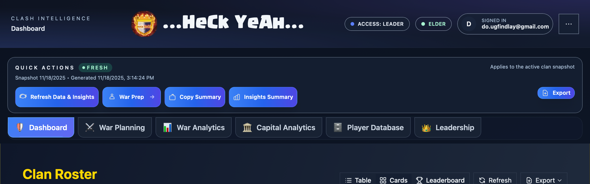
  - **How to reproduce:** Same as above, screenshot focuses on Quick Actions section.

#### 4.2 War Planning (`/war`)
- **Purpose:** Assemble war plan, compare opponent roster, trigger AI briefing.
- **Sections:**
  1. **Roster selection cards** (our roster, opponent roster) pulling from `/api/v2/war-planning/our-selection` and `/opponents`.
  2. **Plan workspace** – slot assignments, hero deltas, confidence metrics.
  3. **AI Analysis toggle** – only available when `OPENAI_API_KEY` is set; displays source (“AI (model)” vs “Heuristic”).
  4. **Discord brief builder** – formats plan for Discord export.
- **Interactions:** Force refresh opponent data, select attack assignments, save plan via `/api/v2/war-planning/plan`.
- **Error Handling:** Leadership guard, Clash API throttling warnings, AI failure fallback text.
- **Screenshot:** 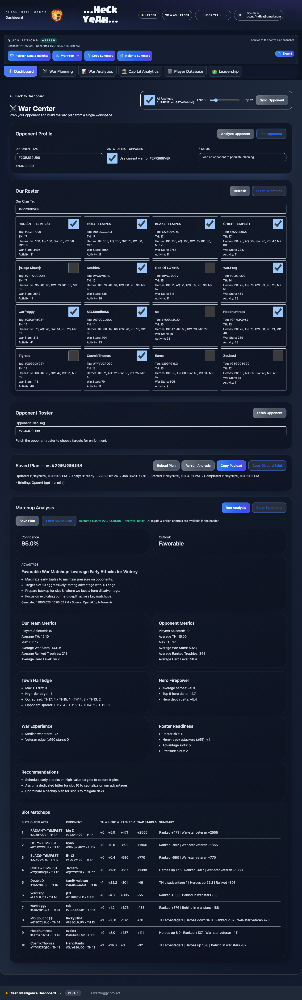
  - **How to reproduce:** Sign in as leader, navigate to `/war`, wait for plan to load with roster panels visible.
- **Discord Brief Builder:** 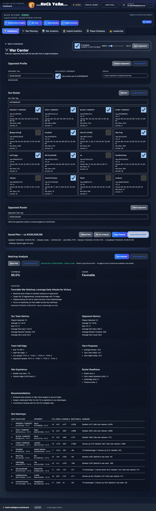
  - **How to reproduce:** From `/war` page, click Discord tab, screenshot shows brief text ready to copy.

#### 4.3 Settings (`/settings`)
- **Purpose:** Manage access, permissions, tracked clans, invitations.
- **Subsections:**
  - **Active Access table (`SettingsContent.tsx`)** – lists each user, email, player tag (if provided). Data from `/api/access/permissions`.
  - **Permissions matrix (`PermissionManager.tsx`)** – headings by feature group (styled via latest UI tweaks). Each permission toggled via role-level selectors.
  - **Tracked Clans (`src/app/api/tracked-clans`)** – home clan locked; additional tracked clans can be added/removed for monitoring.
  - **Invitations/Requests (planned)** – placeholder referencing `PLAYER_TAG_ONBOARDING_PLAN.md`.
- **Interactions:** Edit role assignments, remove tracked clans (non-home), copy onboarding links.
- **Edge Cases:** Non-leaders see read-only view; missing `player_tag` prompts linking guidance.
- **Screenshots:** 
  - 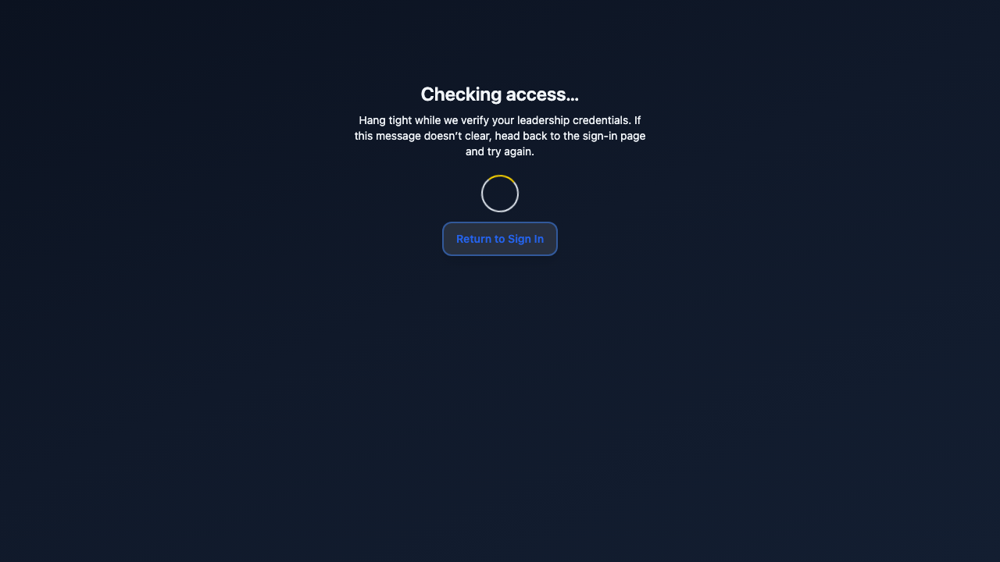
    - **How to reproduce:** Sign in as leader, navigate to `/settings`, scroll to Active Access section showing user table and permissions matrix.
  - 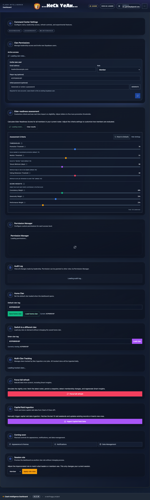
    - **How to reproduce:** From `/settings`, scroll down to Tracked Clans section showing home clan (locked) and any additional tracked clans.

#### 4.4 Player Database (`/player/*`, `/player-database`)
- **Player Profile (`/player/%23TAG`):** Shows hero levels, war stats, linked accounts (reciprocal linking enforced via `player-aliases.ts`). Pulls from Supabase canonical views.
- **Player Database list:** Search/filter interface for all known players; displays TH, role, activity, linked accounts.
- **Linked Accounts:** Display each alias; selecting one should show the entire alias cluster (bidirectional).
- **Screenshot:** 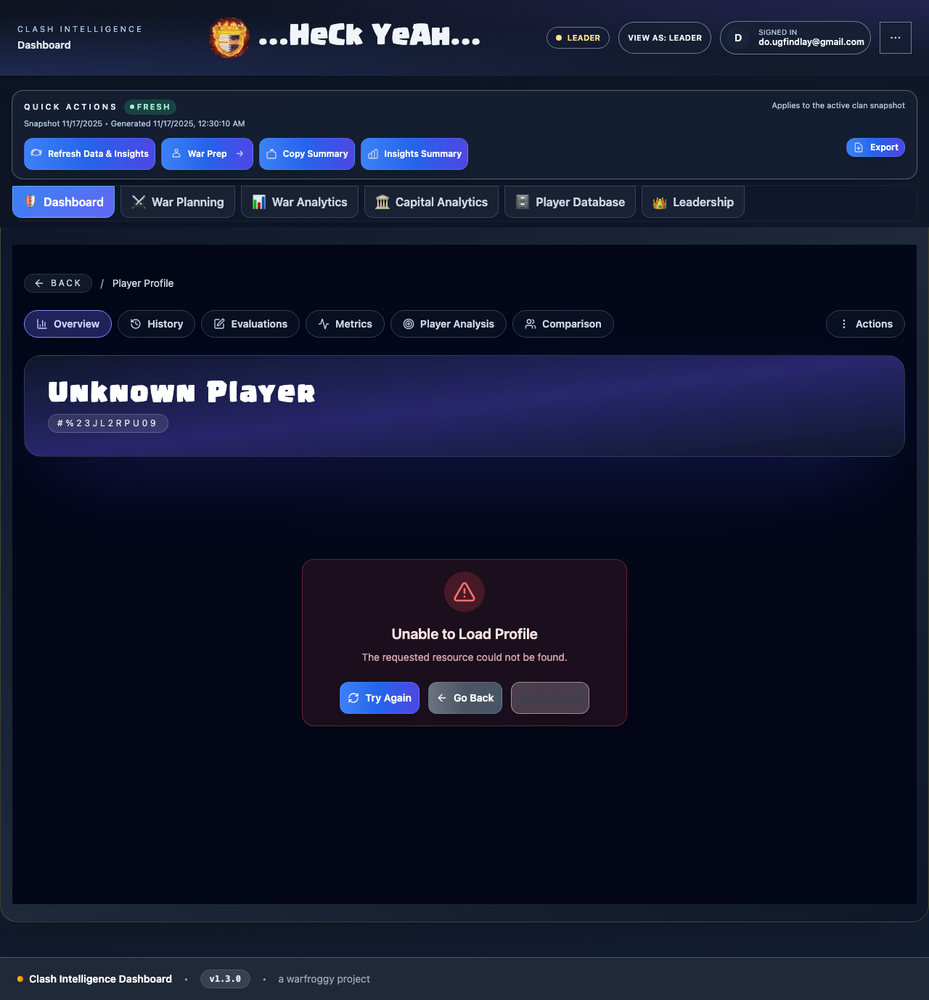
  - **How to reproduce:** Sign in as leader, navigate to `/player/%23JL2RPU09` (or any valid player tag), wait for profile to load showing linked accounts.

#### 4.5 Marketing & Clan Landing Pages
- **Generic root (`/` on apex host):** "The war room for modern clans in Clash of Clans." CTA: Request Access (mailto `info@clashintelligence.com`), Sign In (redirect to clan host).
  - **Screenshot:** 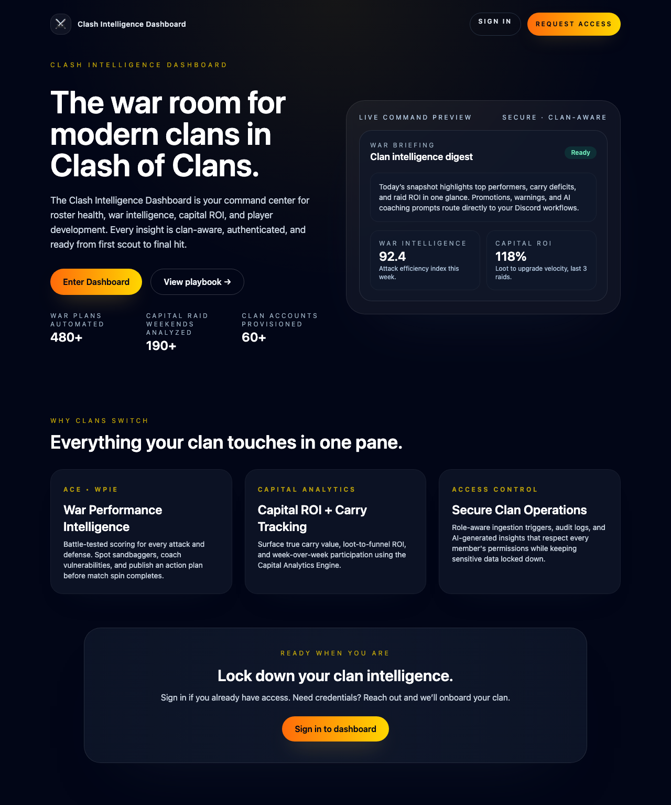
    - **How to reproduce:** Visit `http://localhost:5050/` (apex host), screenshot shows hero section with "The war room..." heading.
- **Clan landing (e.g., `heckyeah.clashintelligence.com`):** Hero banner with "Serving the HeckYeah deployment," CTA buttons to login/FAQ. Uses Clash Display font for clan name.
  - **Screenshot:** 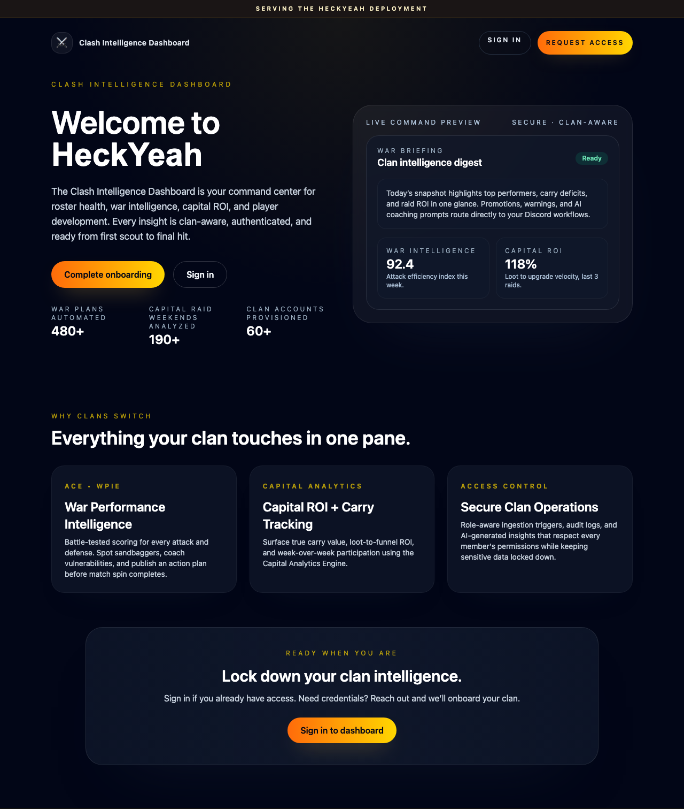
    - **How to reproduce:** Visit `http://heckyeah.localhost:5050/` (clan host), screenshot shows "Welcome to HeckYeah" hero with clan branding.
- **Onboarding landing (`/onboarding` unauthenticated):** Sign-in prompt tailored to clan host.

### 5. API Surface
| Route | Method | Purpose | Auth Guard | Key Params / Body | Data Source | Notes / Consumers |
| --- | --- | --- | --- | --- | --- | --- |
| `/api/session` | GET | Return current user + roles + `needsOnboarding`. | Supabase cookie required. | n/a | `user_roles`, Supabase auth. | Called by `hydrateSession`, AuthGate. |
| `/api/onboarding/roster` | GET | Latest roster for active clan (host-aware). | Auth required; clan inferred from headers. | `x-clan-tag`. | `canonical_member_snapshots`. | Used by `OnboardingClient` to render card list. |
| `/api/onboarding/submit-tags` | POST | Persist selected player tag, auto-link minis. | Auth required. | `{ selectedTags: string[] }`. | `user_roles`, `player_aliases`, `canonical_member_snapshots`. | Updates `needsOnboarding`, invoked from onboarding CTA. |
| `/api/v2/war-planning/our-roster` | GET | Clan roster snapshot meta. | Leadership enforced. | Query params for snapshot selection. | Supabase war tables. | War planning store, `/war` UI. |
| `/api/v2/war-planning/matchup` | POST | Build matchup analysis + optional AI payload. | Leadership. | Clan/opponent tags, plan options. | Supabase snapshots + OpenAI (optional). | Used by `/war` analysis step. |
| `/api/v2/war-planning/plan` | GET/POST | Load or save war plan. | Leadership; plan scoped to user’s clan. | POST body includes plan slots, notes. | `war_plans`, `war_plan_slots`. | `/war` plan editor & Discord brief builder. |
| `/api/v2/war-planning/opponents` | GET | Fetch cached opponent roster or trigger live fetch. | Leadership. | Query `opponentTag`, `forceFetch`. | Cached snapshots + Clash API for selected players. | Opponent selection UI in `/war`. |
| `/api/v2/war-planning/selected` | POST | Persist roster selections (attack assignments). | Leadership. | `{ planId, slots }`. | `war_plan_slots`. | Called when user saves plan changes. |
| `/api/tracked-clans` | GET/POST/DELETE | Manage extra tracked clans beyond home. | Leadership only. | JSON body includes clan tag. | `tracked_clans`. | Settings > Tracked Clans. |
| `/api/tracked-clans/status` | GET | Status of tracked clans ingestion. | Leadership. | n/a | `tracked_clans`, ingestion logs. | Settings overview. |
| `/api/access/permissions` | GET/POST | View/update role permissions per member. | Leadership. | POST body includes role adjustments. | `user_roles`. | Settings > Active Access & Permissions. |
| `/api/player-database` | GET | Return paginated player list. | Leadership (via `requireLeadership`). | Filters via query string. | `player_profiles` view. | Player Database page. |
| `/api/player-database/aliases` | POST | Link/unlink player tags. | Leadership. | `{ primaryTag, aliasTag }`. | `player_aliases`. | Future self-service alias requests. |
| `/api/session/logout` (`/api/logout`) | POST | Clear session server-side. | Auth. | n/a | Supabase auth. | Called from login form pre-check. |

> Continue extending the table for ingestion endpoints (`/api/ingestion/run`, `/api/ingestion/health` if present), capital analytics APIs, Discord integrations, etc. Reference helper modules like `src/lib/war-planning/service.ts` and `src/lib/player-aliases.ts` for deeper logic descriptions.

> Continue expanding this table to cover every Route Handler (ingestion monitor, capital analytics, etc.). Reference helper modules like `src/lib/war-planning/service.ts` to describe business rules (caching, live Clash API fetches, AI toggles).

### 6. Data Sources & Supabase Schema

| Table / View | Purpose | Key Columns & Relationships | Notes / RLS |
| --- | --- | --- | --- |
| `roster_snapshots` | Core clan roster snapshots. | `id`, `clan_tag`, `snapshot_date`, `payload`. | Referenced by `canonical_member_snapshots.snapshot_id`; RLS enabled with service role full access. |
| `member_snapshot_stats` | Per-member stats per snapshot. | `roster_snapshot_id` FK → `roster_snapshots.id`; enriched columns (`activity_score`, `ranked_trophies`, etc. per 2025-02-17 migration). | Used to power roster cards, ACE calculations. |
| `canonical_member_snapshots` | Single source of truth for onboarding + player profiles. | `clan_tag`, `player_tag`, `snapshot_id`, `payload`. Indexes on `clan_tag` and `player_tag` for fast lookups. | RLS: authenticated can read, service role full access. |
| `user_roles` | Access control + onboarding target. | `user_id`, `clan_id`, `clan_tag`, `role`, `player_tag`. | `getUserClanRoles()` selects `clans(tag)` relation; API enforces leadership. |
| `player_aliases` / `player_alias_links` | Stores alias clusters between player tags. | `primary_tag`, `alias_tag`, metadata on who linked. | `linkPlayerTags()` ensures reciprocals; future self-service alias requests will write here. |
| `war_plans` | Saved plan metadata (one per clan vs opponent). | `id`, `our_clan_tag`, `opponent_clan_tag`, selections JSON. | Additional tables (`war_plan_slots`, `war_plan_metrics`, `war_plan_ai_results`) introduced in later migrations (2025-02-25+). |
| `war_plan_slots` (if present) | Individual slot assignments. | `plan_id` FK → `war_plans.id`, `slot_number`, `player_tag`, `target_tag`. | `/api/v2/war-planning/plan` reads/writes slots. |
| `war_plan_analysis_jobs` / `background_jobs` | Track AI analysis jobs/logs. | `job_id`, `status`, `payload`. | Helps debug AI runs; referenced in operations. |
| `tracked_clans` | Leader-managed list of non-home clans to ingest. | `clan_tag` (unique), `added_by`, `is_active`. | RLS: authenticated read; service role write. API ensures only leaders modify. |
| `clans` | Clan metadata (tag, name, slug). | `id`, `tag`, `slug`, `home_clan` flag. | Joined with `user_roles.clan_id` to resolve display names. |
| `player_profiles` view | Aggregated player data for `/player-database`. | Derived from canonical snapshots + stats. | Access limited to leadership (enforced via API). |
| `player_history`, `player_day`, `player_day_builder_war` | Longitudinal stats per player. | `player_tag`, `date`, metrics per ingestion plan. | Used for trends, future features. |
| `clan_game_seasons`, `capital_raid_*` tables | Capital raid and clan games analytics. | Multiple related tables (`capital_raid_weekends`, `capital_raid_participants` etc.). | Surface in capital analytics modules. |
| `smart_insights_payloads` | Cached AI insights for dashboard. | `payload`, `clan_tag`, `season`. | Tied to Smart Insights feature flags. |
| `war_prep_pins`, `war_opponent_history` | Future war prep features. | Created via migrations 2025-10-12 and 2025-01-01. | Document once the UI surfaces them. |

- **Relationships:** Document entity diagrams showing how `roster_snapshots` → `member_snapshot_stats` → `canonical_member_snapshots` feed both onboarding and dashboards. Highlight joins between `user_roles` ↔ `clans`, `war_plans` ↔ `war_plan_slots`, `player_aliases` ↔ `player_profiles`.
- **RLS & Access:** Most tables enable row-level security. Service-role APIs (ingestion, war planning) operate via `getSupabaseServerClient` (service key). User-facing APIs rely on Supabase auth context; ensure each RLS policy aligns with API guard (e.g., `canonical_member_snapshots` allows authenticated read so onboarding can fetch roster).
- **Legacy JSON:** `departures.json`, `joiners.json` still power parts of Settings (until Supabase migration). Keep track of their structure and storage path in an appendix; mark their deprecation timeline.
- **Migrations:** Reference `supabase/migrations/*.sql` for exact schema; note key dates when features launched (e.g., `20250216_create_war_plans.sql`).

### 7. Automation, Testing, & Monitoring

#### 7.1 Playwright E2E Suite
- **Location:** `tests/e2e/` – files `landing.spec.ts`, `login.spec.ts`, `onboarding.spec.ts`, `onboarding-auth.spec.ts`, `full-ux.spec.ts`.
- **Commands:**
  - `npm run test:e2e` – runs all browsers headless (Chromium, Firefox, WebKit). Requires free port 5050 or configure env:
    ```
    PLAYWRIGHT_WEB_SERVER_COMMAND="npm run dev:e2e" \
    PLAYWRIGHT_BASE_URL=http://localhost:5110 \
    PLAYWRIGHT_CLAN_HOST=http://heckyeah.localhost:5110 \
    PLAYWRIGHT_APEX_HOST=http://localhost:5110 \
    npm run test:e2e
    ```
  - `npm run test:e2e:headed` – interactive mode.
  - `npx playwright show-report` – open last HTML report.
- **Web Server Control:** `playwright.config.ts` reads `PLAYWRIGHT_SKIP_WEBSERVER=true` to reuse an existing dev server (useful when MCP already started one). Default command `npm run dev` binds to 5050; `dev:e2e` uses 5110 if available.
- **Credentials:** Tests use `PLAYWRIGHT_TEST_EMAIL` / `PLAYWRIGHT_TEST_PASSWORD` (defaults `d.ougfindlay@gmail.com` / `testaccount`). Ensure this user has leader access and `needsOnboarding` state toggled as required.
- **MCP Usage:** In the IDE, invoke the Playwright MCP server to run specific tests or capture screenshots. Provide environment overrides in the MCP command palette when the dev server is already running, and use headed mode to capture images for the manual.

#### 7.2 Other Tests & Tooling
- **Jest/Unit Tests:** (`npm run test`) – currently minimal; document once suites exist (e.g., business logic functions). Lint via `npm run lint`.
- **Supabase Migration Checks:** Use `supabase db diff`/`db push` as part of schema changes (document when migrations must be run).

#### 7.3 Monitoring & CI/CD
- **Vercel:** Auto-builds on push/PR. Monitor build output for TypeScript errors, failing Playwright (if integrated), or missing env vars.
- **Ingestion Monitors:** `scripts/check-ingestion-status.sh`, `scripts/mac-ingestion.ts` – provide instructions for verifying cron jobs. Document where status output lives (e.g., `~/Library/LaunchAgents/...` logs).
- **Health Endpoints:** (If implemented) `GET /api/health` or ingestion-specific health checks. Describe expected JSON and alerting.
- **Supabase Metrics:** Use Supabase dashboard to monitor query performance, RLS logs, background job statuses (if using `background_jobs` table).

#### 7.4 Manual QA Checklist
Run after significant changes or periodically:
1. **Marketing Pages:** Visit `http://localhost:5050` (generic) and `http://heckyeah.localhost:5050` (clan) to verify copy and CTAs.
2. **Login:** Test both generic host (ensures messaging) and clan host login (ensures Supabase session sync).
3. **Onboarding:** For a test user with `needsOnboarding=true`, verify roster fetch, selection summary, success state, and redirect.
4. **Dashboard:** Confirm roster loads, Quick Actions visible based on role, player profile modal opens.
5. **War Planning:** Load opponent data, adjust plan slots, toggle AI analysis (ensure fallback works without OpenAI key).
6. **Settings:** Review Active Access list, edit permissions, manage tracked clans.
7. **Player Database:** Search by tag/name, open linked accounts (ensure reciprocity).
8. **Ingestion:** Trigger manual ingestion (if environment supports), verify logs.
9. **Playwright Smoke:** Run `npm run test:e2e:headed tests/e2e/full-ux.spec.ts --project=chromium` to catch regressions quickly.

### 8. Operational Playbooks & Runbooks

#### 8.1 Ingestion Operations
- **Daily automation:** See `NIGHTLY_INGESTION_SETUP.md` and `AUTOMATED_CRON_FOREVER.md` for launch agent details. Confirm jobs pull the home clan snapshot automatically; tracked clans run on-demand.
- **Manual triggers:** Use Quick Actions → “Ingestion Monitor” to run `run-staged-ingestion`. `forceFetch` parameter overrides “already ran today” safety. Health endpoint (`/api/ingestion/health` if enabled) returns job status.
- **Logs:** Local dev logs display in Next.js console; production logs in Vercel (for API routes) and Supabase (for SQL jobs). When using the CLI scripts (`scripts/setup-one-time-ingestion.sh`), check stdout/err files noted in the script.
- **Troubleshooting:** If snapshots stale, verify Supabase credentials, Clash API limits, and that `home clan` is not in tracked clans removals (per user requirement).
- **Runbook Steps:** (1) Visit Settings → Ingestion Monitor. (2) Choose “Force Fetch” if prior run succeeded but new data needed. (3) Monitor status card + logs. (4) Validate `/api/v2/war-planning/our-roster` returns latest snapshot. Document start/end times in `ACTIVITY_TRACKING_IMPROVEMENTS.md`.

#### 8.2 AI Operations
- **Prereqs:** `OPENAI_API_KEY` (and optionally `WAR_PLANNING_AI_MODEL`). Without them, `/war` displays “Source: Heuristic.”
- **Workflow:** When user clicks “Run AI analysis,” `/api/v2/war-planning/matchup` composes `WarPlanAIPayload` and calls OpenAI. Response populates war brief + Discord summary.
- **Monitoring:** If AI fails, the UI shows fallback messaging (“Source: Heuristic”). Check Next.js server logs for OpenAI errors, ensure env vars exist on Vercel, and consider enabling logging around `war-planning/analysis`.
- **Playwright coverage:** `e2e/full-ux.spec.ts` ensures the AI toggle doesn’t break onboarding; add dedicated tests when AI endpoints become deterministic.
- **Runbook:** (1) Confirm env vars on server. (2) Run `/war`, toggle “AI Analysis”. (3) Inspect server logs for `[war-planning]` entries. (4) If OpenAI unavailable, set feature flag to disable toggle and notify leadership via Discord using `buildDiscordWarBrief`.

#### 8.3 Access Management
- **Invitations:** Current flow requires manual Supabase entry; future “Player Tag Onboarding System” (see `PLAYER_TAG_ONBOARDING_PLAN.md`) will require leaders to pre-specify tags.
- **Linking tags manually:** Use Supabase table editor (`user_roles`, `player_aliases`) to set `player_tag` or add alias clusters. Ensure reciprocity (`linkPlayerTags` handles auto-mirroring).
- **Revoking access:** Settings → Active Access (remove user), or delete `user_roles` record. Remind users to sign out; `/api/logout` clears server session.
- **Multi-account emails:** Encourage users to add all tags during onboarding; alias list remains private unless they surface it.
- **Invitation Runbook (current manual process):** (1) Collect email + clan role + primary tag from leader. (2) Insert row into `user_roles` with `player_tag=null`. (3) Send Supabase invite email. (4) User signs in, completes onboarding. Track in `PLAYER_TAG_ONBOARDING_PLAN.md` for future automation.

#### 8.4 Incident Response
- **Logs:** Next dev server console, Vercel function logs, Supabase logs (SQL errors). For ingestion, check Mac launch agent logs.
- **Emergency disables:** `EMERGENCY_DISABLE_ALL.md` outlines toggles. You can flip feature flags via env vars (e.g., disable AI by unsetting key). `AuthGuard` ensures unauthorized users cannot reach sensitive routes.
- **Rollback:** Revert offending deployment via Vercel dashboard or redeploy previous commit. For Supabase schema issues, use migration scripts (if available) or restore backups.
- **Checklist for production incident:** (1) Identify scope (UI/API/ingestion). (2) Gather logs (Vercel + Supabase). (3) Communicate in leadership channel. (4) Apply mitigation (disable feature/env). (5) Create follow-up issue referencing relevant plan docs. (6) Update Change Log / manual if behavior changed.

#### 8.5 Additional Playbooks
- **Tracked clan ingestion:** Document steps to add a new tracked clan, validate ingestion, and remove it if necessary (ensuring home clan is never removed).
- **Player tag onboarding migration:** Follow `PLAYER_TAG_ONBOARDING_PLAN.md` and `security-and-code-quality-fixes.plan.md` for future bulk migrations, ensuring `needsOnboarding` flags are set correctly.
- **Discord brief ops:** Outline how to copy/paste the Discord brief from `/war`, and what data sources it references.

### 9. Appendices
#### 9.1 Glossary
| Term | Definition |
| --- | --- |
| **Home Clan** | Primary clan configured in `cfg.homeClanTag`; must always be tracked and ingested automatically. |
| **Tracked Clan** | Additional clan leaders monitor via Settings; ingestion runs manually/on request. |
| **Minis / Linked Accounts** | Secondary accounts linked to a primary player tag via onboarding or `player_aliases`. |
| **Leadership** | Roles `leader` or `coleader` in `user_roles`. Required for war planning, settings edits, tracked clans. |
| **AuthGate** | Client component guarding protected routes, enforcing session + onboarding requirements. |
| **NeedsOnboarding** | Flag in dashboard store indicating user must select player tag(s) before accessing dashboard. |
| **ACE / WPIE** | Analytical scores referencing attack efficiency; see `WCI_IMPLEMENTATION_PLAN.md`. |
| **Force Fetch** | Ingestion override forcing new snapshot even if one exists today. |

#### 9.2 Permissions Reference (summary)
| Feature | Required Role / Permission |
| --- | --- |
| View dashboard `/app` | Any authenticated member with clan access. |
| War planning `/war`, related APIs | Leadership (leader/coleader) via `requireLeadership`. |
| Settings edits (Active Access, permissions, tracked clans) | Leadership. |
| Quick Actions: Ingestion monitor, force fetch | Leadership with specific permission (`canTriggerIngestion`). |
| Player Database search | Leadership (per API guard). |
| Onboarding completion | Any authenticated user with pending `needsOnboarding`. |
> For full matrix, reference `src/lib/access-management.ts` (`ACCESS_LEVEL_PERMISSIONS`) and `SettingsContent.tsx`.

#### 9.3 Open Questions / TODOs
- Migrate departures/joiners JSON to Supabase tables (remove legacy dependency).
- Implement invitation workflow with leader-specified player tag (per Player Tag Onboarding Plan).
- Expand Playwright suite with AI deterministic checks once mock responses available.
- Document tracked clan ingestion runbook with screenshots once UI stabilizes.
- Capture remaining onboarding screenshots (form, success states) by temporarily clearing `player_tag` for test user.
- Capture ingestion monitor modal screenshot when Quick Actions button is visible.

#### 9.4 Change Log
- **2025-01-XX:** Initial framework + onboarding/auth/hosting sections documented. Added dashboard/API outlines. (Codex)
- **2025-01-YY:** Added Supabase schema catalog, testing instructions, operational playbooks, glossary, permissions summary, TODO list. (Codex)
- **2025-11-17:** Added comprehensive screenshots for dashboard, login, onboarding, and landing pages. Screenshots captured via Playwright automation script (`tests/e2e/screenshots.spec.ts`) using leader test account. All major UI surfaces now have visual references embedded in relevant sections.

---

## Next Steps for Authors
1. Continue expanding Sections 4–9 with the same level of detail (per page/component/API).
2. **Screenshots & MCP workflows:** Use the Playwright MCP server (or `npm run test:e2e:headed` with `--debug`) to capture page states. Save outputs under `docs/assets/<section>/<filename>.png` and reference them in Markdown (``). Record how to reproduce (route + test account).
3. Ensure every new feature or field references this manual in its PR checklist.
4. Keep the Change Log current so readers know what’s fresh.

---
